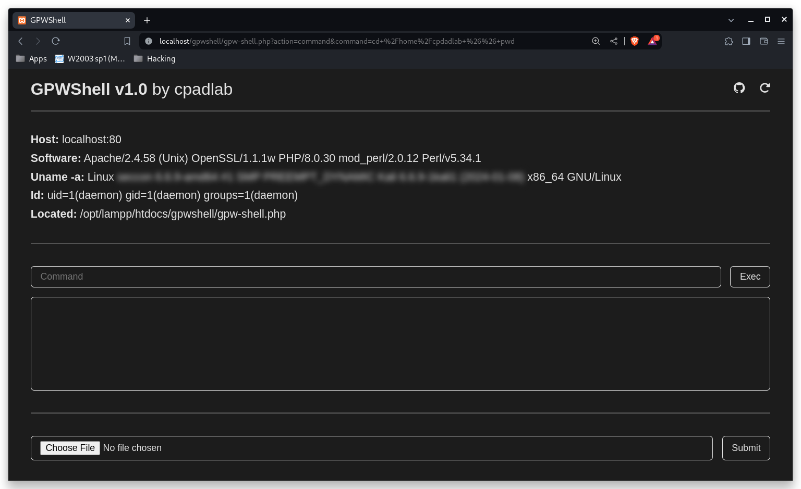

# GPWShell

**Title**: Simple Gui PHP Web Shell

**Author**: [Carlos Padilla (cpadlab)](https://github.com/cpadlab/)

**Medium Post**: [Blog: This is how to create a Simple PHP Web Shell (GPWShell-Proyect)]()

**Author Web**: [Link](https://cpadlab.github.io/)

## Download

1. Download the [file(gpw-shell.php)](https://gist.github.com/cpadlab/3be045083546c6ff19d2ab21db20057b)/[repository](https://github.com/cpadlab/GPWShell) from the following link: [Gist](https://gist.github.com/cpadlab/3be045083546c6ff19d2ab21db20057b) | [Repository](https://github.com/cpadlab/GPWShell)
2. Move the web shell to your http server and start using it!

**Via Gist** (2 options):

```
git clone https://gist.github.com/3be045083546c6ff19d2ab21db20057b.git
```

```
wget https://gist.githubusercontent.com/cpadlab/3be045083546c6ff19d2ab21db20057b/raw/d8bd581c5f2150a98ba3010ba430c75455b963a5/gpw-shell.php
```

**Via Repo**:

```
git clone https://github.com/cpadlab/GPWShell
```

## Gallery

